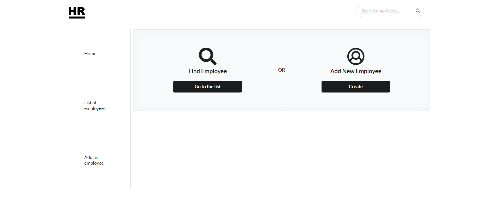
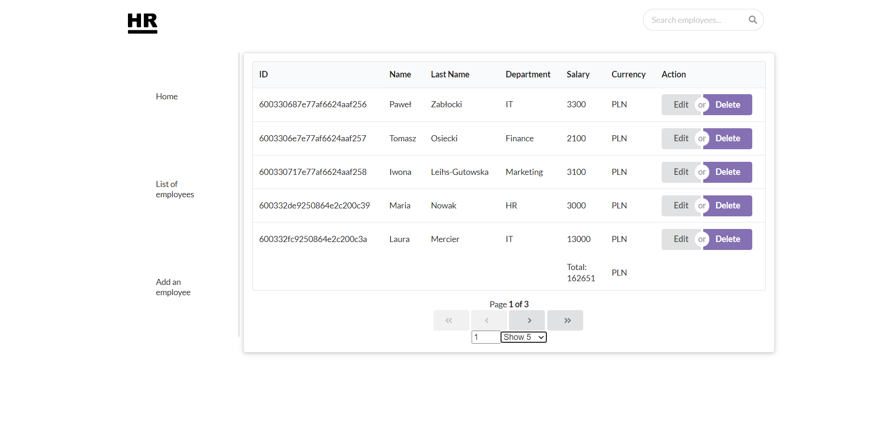
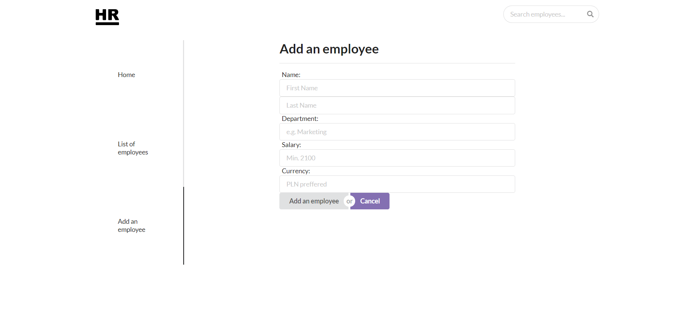
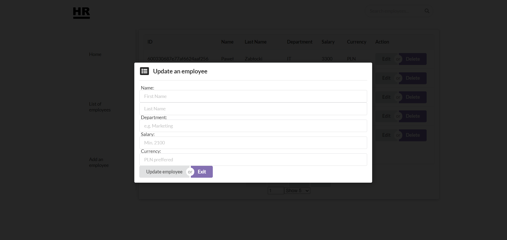
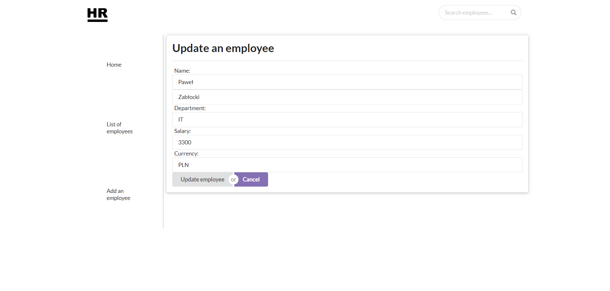

# Human Resources Application
> A fullstack application made for university assignment purposes

## Table of contents
* [General info](#general-info)
* [UI](#ui)
* [Technologies](#technologies)
* [Setup](#setup)
* [Code Examples](#code-examples)
* [Features](#features)
* [Status](#status)
* [Contact](#contact)

## General info
The main goal was to create a fullstack application, to practice MERN technology and CSS frameworks.

## UI
The application was designed in a minimalistic style








## Technologies
* [MongoDB](https://mongoosejs.com/docs/) v5.11.12
* [Express.js](http://expressjs.com/) v4.17.1
* [React.js](https://reactjs.org/) v17.0.1
* [Node.js](https://nodejs.org/en/) v12.19.0
* [Semantic-UI React](https://react.semantic-ui.com/) v2.0.2


## Setup
To install this application you need to clone this repository. Next open it, preferrably in Visual Studio, go to client folder and type "npm start" in the command prompt, next go to the server folder and type the "npm start" command. The application should start itself in a new browser window. Please note, it won't work without one another (both client and server need to be started).

## Code Examples
Updates the user in the remote database and frontside as well:

front-end:
```javascript
    handleUpdateEmployee = async () => {
        const { id, firstName, lastName, department, salary, currency } = this.state
        const payload = { firstName, lastName, department, salary, currency }

        await api.updateEmployeeById(id, payload).then(res => {
            window.alert(`Employee updated successfully`)
            this.setState({ 
                firstName: '',
                lastName: '',
                department: '',
                salary: '',
                currency: ''
            })
        })
 
    }

    componentDidMount = async () => {
        const { id } = this.state
        const employee = await api.getEmployeeById(id)

        this.setState({ 
            firstName: employee.data.data.firstName,
            lastName: employee.data.data.lastName,
            department: employee.data.data.department,
            salary: employee.data.data.salary,
            currency: employee.data.data.currency
        })
    }
```
back-end:
```javascript
updateEmployee = async (req, res) => {
    const body = req.body

    if(!body) {
        return res.status(400).json({
            success: false,
            error: 'You must provide a body to update',
        })
    }

    Employee.findOne({ _id: req.params.id }, (err, employee) => {
        if (err) {
            return res.status(404).json({
                err,
                message: 'Employee not found'
            })
        }

        employee.firstName = body.firstName
        employee.lastName = body.lastName
        employee.department = body.department
        employee.salary = body.salary
        employee.currency = body.currency

        employee
            .save()
            .then(() => {
                return res.status(200).json({
                    success: true,
                    id: employee._id,
                    message: 'Employee was successfully updated'
                })
            })
            .catch(error => {
                return res.status(400).json({
                    error, 
                    message: 'Employee not updated'
                })
            })

    })
}
```
The modal with a form to update the employee
```html
      <Modal 
        open={this.props.modalOpen}
        size='small'
        closeOnEscape={true}
        centered={true}
      >
         <Wrapper className="ui raised centered segment">
                <Header icon="browser" content="Update an employee" />
                <div class="ui divider"></div>
                <Modal.Content>

                <Label>Name:  </Label>
                <InputText 
                    placeholder="First Name"
                    type="text"
                    value={firstName}
                    onChange={this.handleChangeInputFirstName}
                />

                <InputText 
                    placeholder="Last Name"
                    type="text"
                    value={lastName}
                    onChange={this.handleChangeInputLastName}
                />

                <Label>Department: </Label>
                <InputText 
                    placeholder="e.g. Marketing"
                    type="text"
                    value={department}
                    onChange={this.handleChangeInputDepartment}
                />

                <Label>Salary: </Label>
                <InputText 
                    placeholder="Min. 2100"
                    type="number"
                    value={salary}
                    step="100"
                    min="2100"
                    onChange={this.handleChangeInputSalary}
                />

                <Label>Currency: </Label>
                <InputText 
                    placeholder="PLN preffered"
                    type="text"
                    value={currency}
                    onChange={this.handleChangeInputCurrency}
                />

                </Modal.Content>
                <Modal.Actions>
                    <div className="ui buttons">
                        <Button onClick={this.handleUpdateEmployee}>Update employee</Button>
                    <div className="or"></div>
                        <CancelButton href={'/employees/list'}>Exit</CancelButton>
                    </div>
                </Modal.Actions>
            </Wrapper>
    </Modal>
```
## Features
List of features ready and TODOs for future development
* backend and frontend CRUD
* data is saved in the remote MongoDB database  


## Status
Project is: _no longer continued_. 

## Contact
Created by [@jcieszynska](https://www.github.com/jcieszynska) - feel free to contact me!
